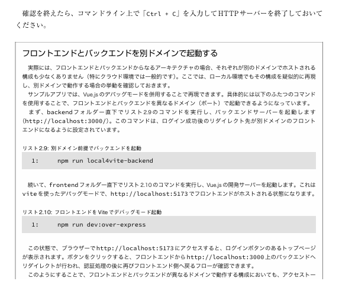
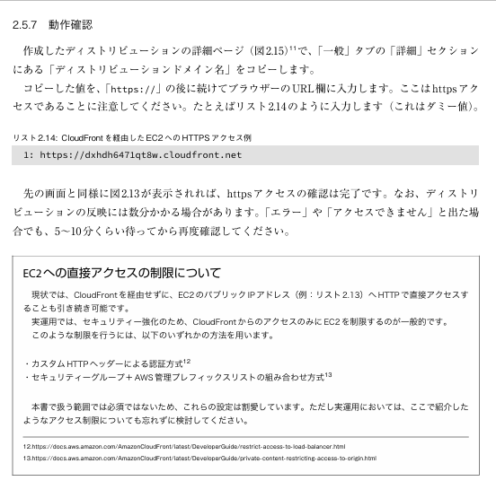
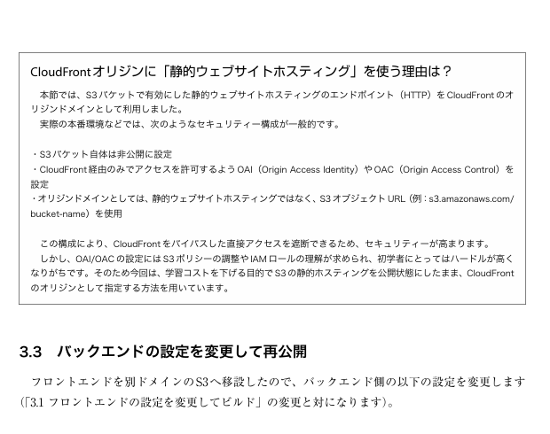
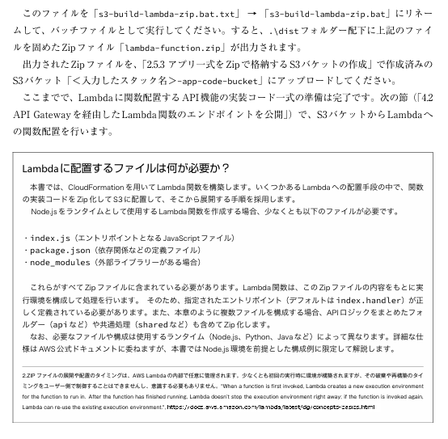

# 一部コラムのレイアウト崩れの正誤表

「 **AWS体験ステップブック　～既存構成から始めるサーバーレス化！～** 」 本の以下のコラムの、正しいレイアウトは以下の通りです。

## P.19：フロントエンドとバックエンドを別ドメインで起動する

## P.43：EC2への直接アクセスの制限について

## P.61：CloudFrontオリジンに「静的ウェブホスティング」を使う理由は？

## P.68：Lambdaに配置するファイルは何が必要か？

